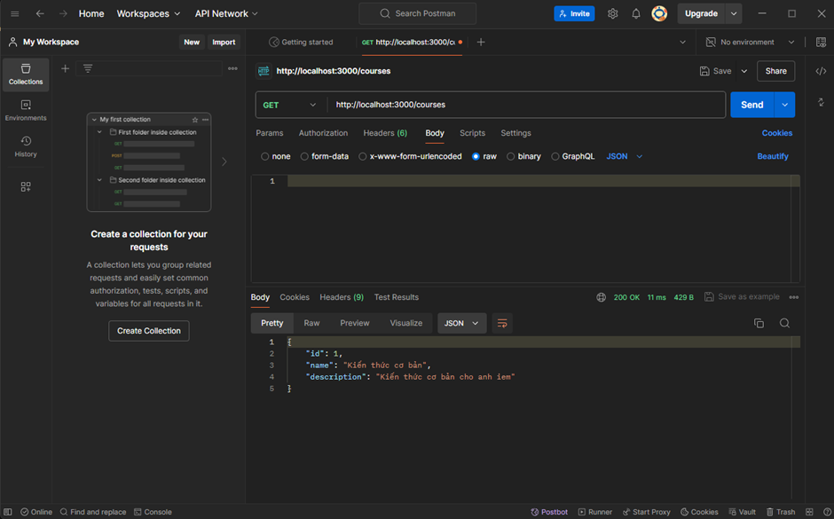

# ThucHanhPostman
I. Giới thiệu Postman
1. Postman là gì?
- Postman là một công cụ phát triển API và kiểm thử API rất phổ biến. Nó cung cấp một giao diện đồ họa dễ sử dụng cho phép bạn tạo, gửi và kiểm tra các yêu cầu HTTP đối với các API.

2. Các tính năng chính của Postman?
- Các tính năng chính của Postman bao gồm:
  +) Tạo yêu cầu HTTP: Postman cho phép bạn tạo các yêu cầu HTTP như GET, POST, PUT, DELETE và nhiều hơn nữa. Bạn có thể chỉ định các thông số như URL, tham số, tiêu đề, thân yêu cầu và xem các kết quả trả về.
  +) Quản lý môi trường: Bạn có thể quản lý các biến môi trường để tùy chỉnh các yêu cầu và phản hồi dựa trên các biến này. Điều này rất hữu ích khi bạn phải làm việc với nhiều môi trường như local, development, production, v.v.
  +) Tạo và chia sẻ bộ sưu tập (collection): Postman cho phép bạn tạo và tổ chức các yêu cầu vào các bộ sưu tập. Bạn có thể chia sẻ bộ sưu tập này với đồng đội hoặc cộng đồng để hỗ trợ cộng tác và tái sử dụng.
  +) Kiểm thử và xác thực: Postman cung cấp các công cụ để kiểm thử và xác thực API. Bạn có thể thực hiện các bài kiểm tra tự động, kiểm tra mô phỏng và kiểm tra hiệu năng để đảm bảo tính ổn định và chính xác của API.
3. Cách cài đặt và sử dụng Postman? 
- Cài đặt: Postman có phiên bản cho Windows, macOS và Linux. Bạn có thể tải xuống và cài đặt Postman từ trang web chính thức của nó: https://www.postman.com/downloads/
- Giao diện chính: Sau khi cài đặt, bạn sẽ thấy giao diện chính của Postman với các tab như "Collections", "History", "Environments", "Mocks" và "Runner".
- Tạo yêu cầu: Bạn có thể tạo yêu cầu bằng cách chọn phương thức HTTP (GET, POST, PUT, DELETE) và điền URL cần gửi yêu cầu. Bạn có thể thêm tiêu đề, tham số và thân yêu cầu tuỳ theo yêu cầu của API.
- Kiểm tra yêu cầu: Sau khi tạo yêu cầu, bạn có thể gửi yêu cầu và xem kết quả trả về từ API. Postman hiển thị các phản hồi trong cửa sổ "Response" và cho phép bạn xem thông tin chi tiết như mã trạng thái, tiêu đề và thân phản hồi.
- Quản lý môi trường: Bạn có thể tạo các biến môi trường và sử dụng chúng trong yêu cầu. Điều này giúp bạn tùy chỉnh các yêu cầu dựa trên môi trường như local, development, production, v.v.
II. Kiểm thử API cơ bản:
- Gửi các yêu cầu HTTP (GET, POST, PUT, DELETE) đến API.
  + GET
   
- Kiểm tra mã trạng thái HTTP và nội dung phản hồi.
- Sử dụng các biến và bộ sưu tập dữ liệu trong Postman.
